# Алгоритм выбора и ротации тикеров — Supervisor

> Полная документация логики `supervisor.py` — от сканера до PM2.

## Общая архитектура (manage_swarm)

```mermaid
flowchart TD
    A([🚀 Начало цикла manage_swarm]) --> B[Загрузка config.json]
    B --> C[BinanceConnector.verify_connection]
    C --> D[enforce_swarm_consistency\nПроверка биржевых позиций vs PM2]

    D --> E{Есть позиции на бирже\nбез PM2 процесса?}
    E -- Да, state валиден --> F[HEAL: перезапуск\nreal-бота из стейта]
    E -- Да, state невалиден --> G[Закрытие позиций\nна бирже]
    E -- Нет --> H[Чтение signal-флагов\nиз /signals/]
    F --> H
    G --> H

    H --> I{Есть stop_*.flag?}
    I -- Да --> J[Запись тикера в\ntoxic_blacklist\n+ cooldown_sec]
    I -- Нет --> K[Удаление всех\nstop_*.flag и exit_*.flag]
    J --> K

    K --> L[Prune expired\nиз toxic_blacklist]
    L --> M[get_running_bots_info\npm2 jlist — один вызов на цикл]
    M --> N[run_scanner\nrank_tickers.py\nmin_volume=20M]

    N --> O{Scanner\nвернул результаты?}
    O -- Нет --> P[❌ ABORT\nCycle aborted]
    O -- Да --> Q[Фильтрация toxic\nиз scanner_results]

    Q --> R[selective_merge_incubator\nРотация инкубатора paper-ботов]
    R --> S[Выбор Чемпионов\nдля REAL\ncalculate_bot_score]

    S --> T[enforce_invariant_gate\nЗащита: не убирать тикер\nс открытой позицией]
    T --> U[Authoritative Cleanup\nЗакрытие stray-позиций]
    U --> V[PM2: остановка\nлишних ботов]
    V --> W[PM2: запуск\nновых paper + real]
    W --> X[Сохранение live_swarm\n= target_real_bots]
    X --> Y[enforce_invariant_gate\nПовторная проверка]
    Y --> Z[pm2 save]
    Z --> AA[_ensure_real_bots_alive\nФинальная проверка PM2]
    AA --> AB([✅ Cycle Complete])
```

---

## enforce_swarm_consistency — Проверка согласованности роя

```mermaid
flowchart TD
    A[enforce_swarm_consistency] --> B[get_positions\nВсе позиции на бирже]
    B --> C[get_running_bots_info\npm2 jlist]
    C --> D[allowed = live_swarm ∪ real_whitelist]

    D --> E{Для каждой позиции\npos_key на бирже}
    E --> F{ticker ∈ allowed\nИ\nticker ∈ running_real?}
    F -- Да → Всё OK --> E
    F -- Нет --> G{state_path\nсуществует?}
    G -- Да --> H{rebalance_cycles > 0\nИЛИ\nvirt_qty > 0?}
    H -- Да --> I[to_heal_tickers.add\nHEAL — перезапуск]
    H -- Нет --> J{to_close_tickers.add\nЗакрытие позиций]
    G -- Нет --> K{allowed\nпуст?}
    K -- Да --> J
    K -- Нет --> L{ticker ∉ allowed?}
    L -- Да --> J
    L -- Нет --> E

    I --> M[Для каждого healed:\nticker → live_swarm\nstart_bot real]
    J --> N[Для каждого to_close:\nmain.py --stop --real]
    M --> O([return to_heal_tickers])
    N --> O
```

---

## Чтение signal-флагов

```mermaid
flowchart TD
    A[signals_dir.exists?] --> B{glob stop_*.flag}
    B --> C[Для каждого файла:\nticker = stem[5:]\nexpiry = now + cooldown_sec]
    C --> D[toxic_blacklist[ticker] = expiry]
    D --> E[Лог: STOP signal received]
    E --> F[Удалить все stop_*.flag]
    F --> G[Удалить все exit_*.flag]
    G --> H[Prune expired:\nexpiry < now → удалить]
    H --> I([toxic_blacklist обновлён])
```

> ⚠️ **BUG**: Обрабатываются только `stop_*.flag`. `exit_*.flag` удаляется **без записи в toxic_blacklist**. Если main.py отправляет "exit" (прибыльный trailing stop), тикер НЕ блокируется.

---

## selective_merge_incubator — Ротация инкубатора (paper)

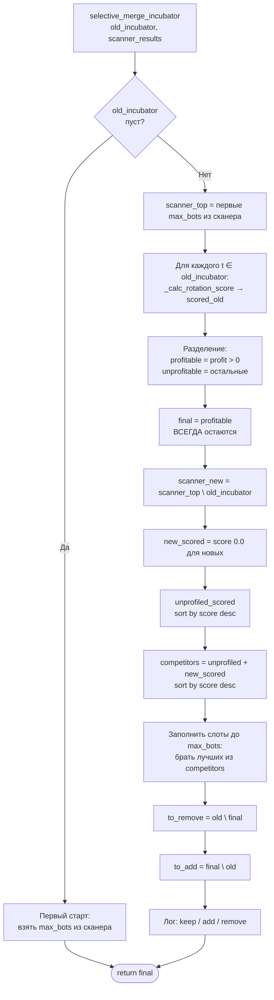

### _calc_rotation_score

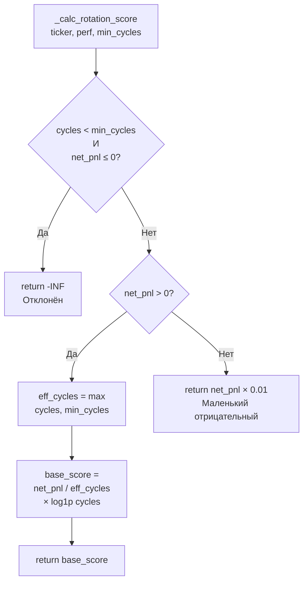

---

## Выбор Чемпионов для REAL

### Часть 1: Сбор данных и скоринг

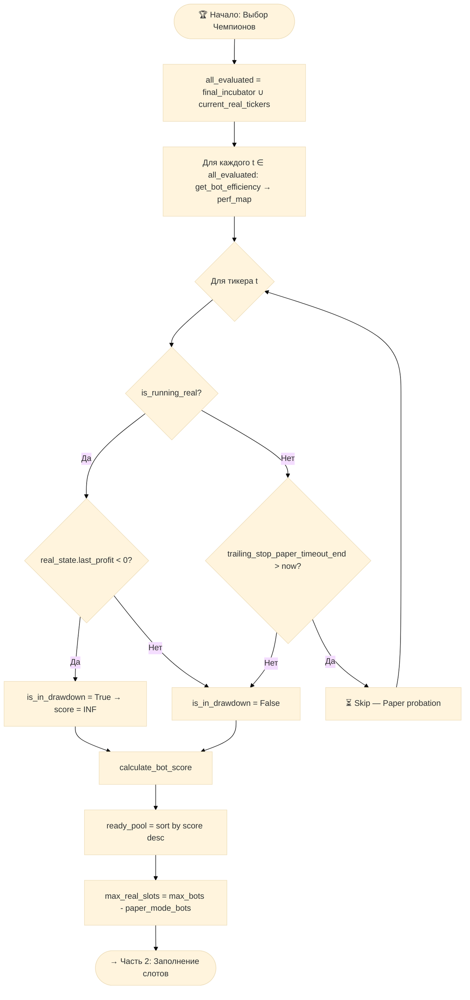

### Часть 2: Заполнение слотов и замена

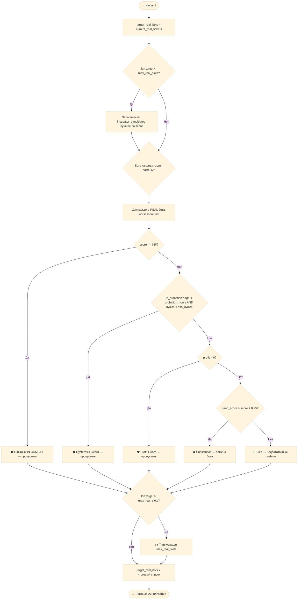

### Часть 3: Финализация и сохранение

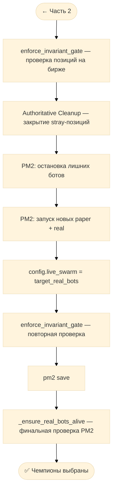

### Сводка: Цепочка  Guards

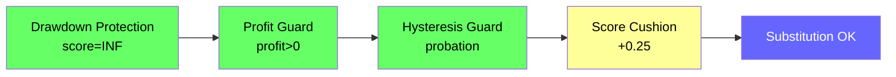

---

## calculate_bot_score

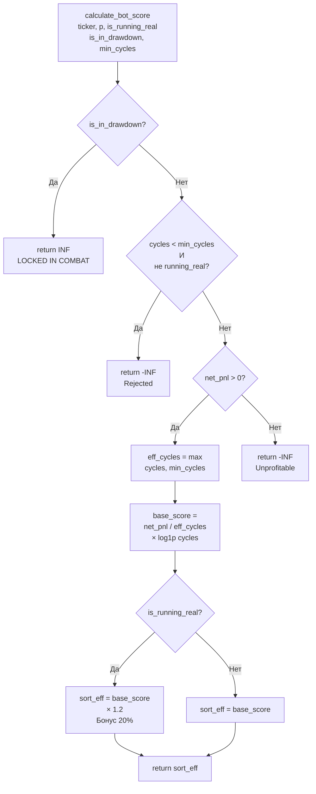

---

## enforce_invariant_gate — Защита инварианта

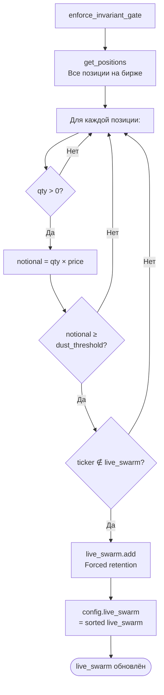

---

## Полный цикл: от сканера до PM2

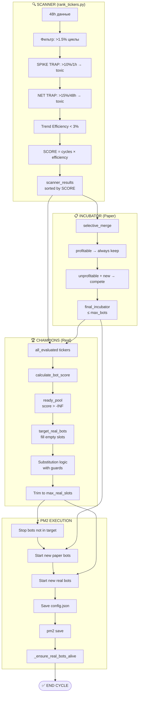

---

## Защитные механизмы (Guards)

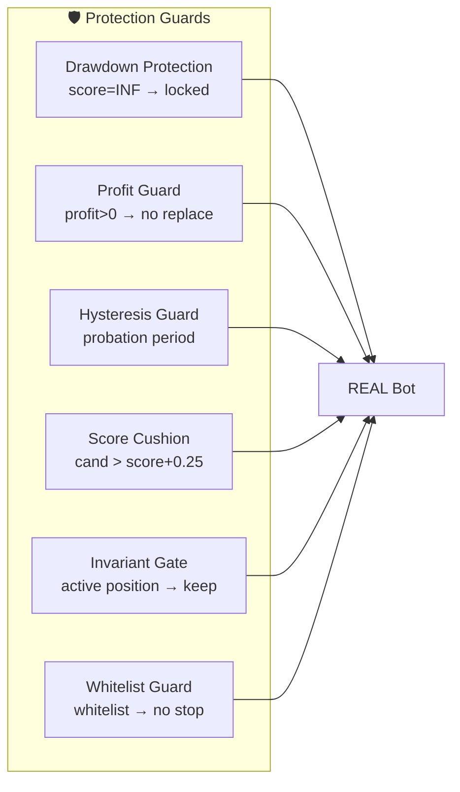

---

## Известные баги и проблемы

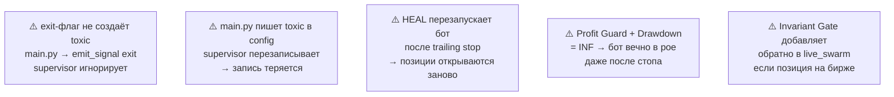

---

## Таблица параметров конфига

| Параметр | Значение | Назначение |
|----------|----------|------------|
| `max_bots` | 20 | Макс. ботов в инкубаторе |
| `paper_mode_bots` | 19 | Из них paper → real_slots = 1 |
| `min_cycles_for_rank` | 60 | Мин. циклов для скоринга |
| `max_replace_per_cycle` | 10 | Макс. замен за цикл |
| `probation_period_days` | 0.01 (~14 min) | Испытательный срок |
| `toxic_cooldown_days` | 0.02 (~29 min) | Кулдаун toxic |
| `equity_trailing_stop_pct` | 5.7% | Трейлинг стоп |
| `equity_trailing_stop_activation_pct` | 6.5% | Активация трейлинга |
| `equity_trailing_stop_timeout_sec` | 60 | Таймаут перед стопом |
| `supervisor_interval_days` | 0.02 (~29 min) | Интервал цикла |

---

## Связанные заметки

- [[INJUSDT — Реальная торговля vs Бэктесты]]
- [[Backtest Analysis 060626]]
- [[Supervisor — Архитектура и баги]]
